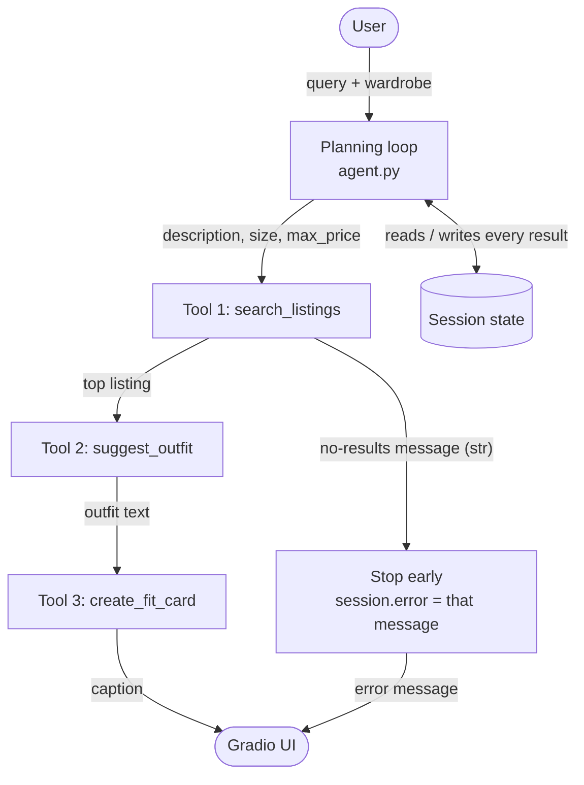

# FitFindr — planning.md

> Complete this document before writing any implementation code.
> Your spec and agent diagram are what you'll use to direct AI tools (Claude, Copilot, etc.) to generate your implementation — the more specific they are, the more useful the generated code will be.
> Your planning.md will be reviewed as part of your submission.
> Update it before starting any stretch features.

---

## Tools

FitFindr uses three tools. All three live in `tools.py` and are plain Python functions so each can be unit-tested on its own before the planning loop in `agent.py` calls them. Tool 1 is deterministic (no LLM). Tools 2 and 3 call the Groq API (`openai/gpt-oss-120b`, configurable via `GROQ_MODEL` in `.env`; the course-suggested `meta-llama/llama-4-scout-17b-16e-instruct` has been retired from Groq and returns 404).

### Tool 1: search_listings

**What it does:**
Searches the 40-item mock dataset in `data/listings.json` for listings that match a free-text description, then filters by size and price ceiling. It is a deterministic keyword search — no LLM call — so results are repeatable and cheap.

**Input parameters:**
- `description` (str): Free-text keywords describing the item, e.g. `"vintage graphic tee"`. This is the only required argument. The string is lower-cased and split into keywords; stopwords (`a`, `the`, `and`, `some`, `in`, `for`, ...) are dropped.
- `size` (str | None): Size to filter by, e.g. `"M"`, `"US 8"`, `"W30"`. `None` (default) skips the size filter. Matching is case-insensitive and token-based: the size string is split on spaces, slashes, and parentheses, and every requested token must appear in the listing's tokens. So `"M"` matches `"S/M"`, `"M/L"` and `"M"`, and `"8"` matches `"US 8"` but not `"US 8.5"` or `"W28"`.
- `max_price` (float | None): Inclusive price ceiling in dollars. `None` (default) skips the price filter.

**What it returns:**
On success, a `list[dict]` of listing dicts, best match first (return type is `list[dict] | str`, see failure cases below). Each dict is the unmodified listing record from the dataset with these fields: `id`, `title`, `description`, `category`, `style_tags` (list[str]), `size`, `condition`, `price` (float), `colors` (list[str]), `brand` (str | None), `platform`.

Relevance scoring, per keyword in `description` (case-insensitive substring match):

| Where the keyword appears | Points |
|---|---|
| any entry in `style_tags` | +3 |
| `title` | +2 |
| `category` (e.g. keyword `"tops"`) | +2 |
| `description` | +1 |

Scores are summed across all keywords. Listings with a total score of 0 are dropped. Ties are broken by lower price, so the cheaper item wins when relevance is equal.

**What happens if it fails or returns nothing:**
- No listing passes the filters, or every remaining listing scores 0 → return an informative message **string** instead of a list, e.g. *"No listings matched 'designer ballgown' in size XXS under $5.00. Try loosening the size or price filter, or different keywords."* The message echoes back whichever filters were used. The function never raises and never returns an empty list for "no match".
- `description` is empty or only stopwords → return the string *"No search terms found. Tell me what kind of item you're looking for (e.g. 'vintage graphic tee')."*
- The dataset file cannot be read (missing/corrupt JSON) → this is a real bug, not a user-facing condition, so the exception propagates. `run_agent()` catches it and stores a message in `session["error"]`.

The agent checks `isinstance(result, str)`: a string means "nothing found", so it copies that message into `session["error"]` and returns without calling Tool 2 or Tool 3. The wording comes from the tool, not the loop, so the same message appears whether the tool is called directly or through the agent.

---

### Tool 2: suggest_outfit

**What it does:**
Takes one listing (the item the user is considering) and the user's wardrobe, and asks the LLM for 1–2 complete outfits that combine the new item with named pieces the user already owns. If the wardrobe is empty it falls back to general styling advice for the item.

**Input parameters:**
- `new_item` (dict): A listing dict exactly as returned by `search_listings` (uses `title`, `category`, `colors`, `style_tags`, `description`, `size`).
- `wardrobe` (dict): A wardrobe in the `data/wardrobe_schema.json` format: `{"items": [ {id, name, category, colors, style_tags, notes}, ... ]}`. May have an empty `items` list.

**What it returns:**
A non-empty `str` containing the outfit suggestion(s). The prompt asks for 1–2 outfits, each built from the new item plus 2–3 wardrobe pieces referred to by their `name`, plus one sentence on why the combination works (color, silhouette, or style-tag overlap). The LLM is called at temperature 0.7 so the suggestions are varied but stay grounded in the pieces actually listed.

Prompt construction:
1. System message: "You are a thrift-savvy personal stylist. Only reference wardrobe pieces that are listed. Be specific and concise." The empty-wardrobe path uses a different system message that says the user has no wardrobe on file and that the model must never ask for more information; with the shared message the model sometimes replied by asking the user to list their wardrobe instead of giving advice.
2. User message: the new item formatted as a short spec (title, category, colors, style tags, description), then the wardrobe as a bulleted list of `name (category, colors, style_tags, notes)`, then the instruction for 1–2 outfits.

**What happens if it fails or returns nothing:**
- `wardrobe["items"]` is empty (or the `items` key is missing) → do **not** error. Send a different prompt asking for general styling advice: what categories of pieces pair well with the item, what vibe it suits, and 2 example outfits built from common basics. Return that string.
- The Groq call raises (network error, bad key, rate limit) → catch it inside the tool and return a short fallback string built without the LLM: a template outfit that pairs the item with up to two wardrobe items from complementary categories (e.g. a top gets the first `bottoms` and first `shoes`). The returned string starts with `"[fallback]"` so the agent and UI can tell it apart from a real suggestion.
- The LLM returns an empty/whitespace response → treated the same as an exception (use the template fallback). The function therefore always returns a non-empty string.

---

### Tool 3: create_fit_card

**What it does:**
Turns an outfit suggestion plus the listing into a short, shareable 2–4 sentence caption written in the voice of a real "outfit of the day" post. It mentions the item name, price, and platform once each.

**Input parameters:**
- `outfit` (str): The outfit suggestion string produced by `suggest_outfit`.
- `new_item` (dict): The same listing dict used for Tool 2 (uses `title`, `price`, `platform`, `style_tags`, `colors`).

**What it returns:**
A `str` of 2–4 sentences suitable for an Instagram/TikTok caption. It should sound casual and specific (name the vibe, not "great item"), and mention the title, `$price`, and platform naturally. The LLM is called at temperature 1.0 so two runs with the same inputs produce different wording. The tool trims whitespace and strips surrounding quotes the model sometimes adds.

**What happens if it fails or returns nothing:**
- `outfit` is `None`, empty, or whitespace-only → return the string `"Error: cannot create a fit card without an outfit suggestion."` immediately, without calling the LLM. No exception is raised.
- `new_item` is missing `title`, `price`, or `platform` → return `"Error: listing is missing required fields (title, price, platform)."`.
- The Groq call raises or returns an empty response → return a template caption built from the item fields, e.g. *"Thrifted this {title} on {platform} for ${price} and it's already on repeat. {first line of outfit}"*, prefixed with `"[fallback]"`.

Because Tool 3 never raises, the agent can always populate `session["fit_card"]` with a string; the UI simply shows whatever comes back.

---

### Additional Tools (if any)

None for the core submission. The planning loop also contains a query parser (`_parse_query`), but it is a private helper inside `agent.py`, not an agent tool, because it never touches external data or the LLM.

---

## Planning Loop

**How does your agent decide which tool to call next?**

The planning loop in `run_agent()` is a fixed, sequential pipeline with early exits — the order is always parse → search → suggest → fit card, because each tool's input is the previous tool's output. The "decisions" the loop makes are whether to continue, which item to select, and which prompt path Tool 2 takes.

1. **Initialize** `session = _new_session(query, wardrobe)`.
2. **Parse the query** with `_parse_query(query)` (regex, no LLM — documented below). Store `{"description", "size", "max_price"}` in `session["parsed"]`.
   - An empty `description` is not special-cased here; `search_listings` returns its own "No search terms found..." message, which step 3 handles.
3. **Call `search_listings(**session["parsed"])`.**
   - Condition: `isinstance(result, str)` → the tool found nothing and returned its message. Copy it into `session["error"]`, leave `search_results` as `[]`, and **return early**. Tools 2 and 3 are never called with empty input.
   - Otherwise store the list in `session["search_results"]`.
   - Condition: the call raised (data file problem) → set `session["error"]` to the exception text and return.
4. **Select the item.** `session["selected_item"] = session["search_results"][0]` (highest score, cheapest on ties). The rest of the list is kept in the session so the UI can show "also found N other matches".
5. **Call `suggest_outfit(selected_item, session["wardrobe"])`.** Store the string in `session["outfit_suggestion"]`. The tool itself branches on whether the wardrobe is empty; the loop does not need to.
6. **Call `create_fit_card(session["outfit_suggestion"], selected_item)`.** Store the result in `session["fit_card"]`.
   - Condition: the outfit string is empty (should not happen because Tool 2 always returns text, but is guarded anyway) → the tool returns its error string, which the loop stores in `session["fit_card"]` and also copies into `session["error"]`.
7. **Done.** The loop knows it is finished when `session["fit_card"]` is set or `session["error"]` is set. It returns the session dict.

**Query parsing choice:** regex. Price: `(under|below|less than|max|<)\s*\$?(\d+)` or a bare `$N`. Size: `size\s+([A-Za-z0-9/. ]+)` or `in (XS|S|M|L|XL|XXL|XXS)\b`. The description is the **first sentence** of the query (split on `.`, `?`, `!`) with the matched price/size phrases removed and filler ("looking for", "I want", "something", "please") stripped. Later sentences usually describe the user's existing wardrobe or ask a styling question, which the wardrobe dict and Tools 2–3 already cover, so they are not used for search. Regex was chosen over an LLM parse because it is free, instant, deterministic, and easy to unit-test; the trade-off is that unusual phrasings ("thirty bucks tops") won't be parsed, and the description falls back to the full query text in that case.

---

## State Management

**How does information from one tool get passed to the next?**

All state for one interaction lives in a single `session` dict created by `_new_session()` and returned by `run_agent()`. Nothing is stored in module-level globals, so two calls to `run_agent()` never leak into each other.

| Key | Written by | Read by |
|---|---|---|
| `query` | `_new_session` | `_parse_query` |
| `parsed` (`description`, `size`, `max_price`) | step 2 | `search_listings`, error messages |
| `search_results` | step 3 | step 4, UI ("N other matches") |
| `selected_item` | step 4 | `suggest_outfit`, `create_fit_card`, UI listing panel |
| `wardrobe` | `_new_session` (from caller) | `suggest_outfit` |
| `outfit_suggestion` | step 5 | `create_fit_card`, UI outfit panel |
| `fit_card` | step 6 | UI fit-card panel |
| `error` | any early exit | `run_agent` caller / UI |

Data is passed by explicit function arguments, not by tools reading the session: the loop pulls a value out of the session, calls the tool with it, and writes the return value back. This keeps each tool independently testable with hand-built inputs. The wardrobe is chosen by the caller (`app.py` maps the radio button to `get_example_wardrobe()` or `get_empty_wardrobe()`) and is stored in the session unchanged. The session dict is the only return value of `run_agent()`, so the UI in `app.py` reads `error` first and then maps `selected_item`, `outfit_suggestion`, and `fit_card` to its three output panels.

---

## Error Handling

For each tool, describe the specific failure mode you're handling and what the agent does in response.

| Tool | Failure mode | Agent response |
|------|-------------|----------------|
| search_listings | No results match the query (all filtered out by size/price, or every keyword scores 0) | Tool returns the string *"No listings matched '{description}'{ in size X}{ under $Y}. Try loosening the size or price filter, or different keywords."* (never raises, never returns `[]`). Loop detects the string, copies it into `session["error"]`, and returns immediately. `suggest_outfit` and `create_fit_card` are not called. UI shows the message in the listing panel and blanks the other two. |
| search_listings | Description is empty or only stopwords | Tool returns *"No search terms found. Tell me what kind of item you're looking for (e.g. 'vintage graphic tee')."* Loop handles it the same way as no results. |
| suggest_outfit | Wardrobe is empty (`items == []` or missing) | Tool switches to the "general styling advice" prompt and returns that text. The loop proceeds to the fit card as normal. |
| suggest_outfit | Groq API error or empty LLM response | Tool catches the exception and returns a `"[fallback]"` template outfit built from up to two complementary wardrobe pieces (or generic basics if the wardrobe is empty). Loop continues; the fallback prefix is visible to the user. |
| create_fit_card | Outfit input is missing, empty, or whitespace | Tool returns *"Error: cannot create a fit card without an outfit suggestion."* without calling the LLM. Loop stores it in `fit_card` and copies it to `session["error"]`. |
| create_fit_card | Listing missing `title`/`price`/`platform`, or Groq API error | Missing fields → descriptive error string. API error → `"[fallback]"` template caption built from the item fields. No exception escapes. |
| run_agent (loop) | Any unexpected exception from a tool | Wrapped in `try/except`; the message is stored in `session["error"]` so the Gradio UI always gets a response instead of a stack trace. |

---

## Architecture



- **User → Planning loop:** the query and the chosen wardrobe come in.
- **Planning loop → Tools:** the loop calls the three tools in order. Each arrow is labeled with the data handed to the next tool: parsed filters, then the top listing, then the outfit text, then the caption.
- **Error branch:** if `search_listings` finds nothing it returns a message string instead of a list. The loop stops, stores that message in `session.error`, and sends only it to the UI. Tools 2 and 3 are never called.
- **Session state:** every tool result is written into the session dict and read back for the next tool. Its keys are listed in the State Management section above.
- Two other failures are handled inside the tools and do not stop the run: an empty wardrobe makes Tool 2 return general styling advice, and a missing outfit makes Tool 3 return an error string instead of a caption.

Same thing as plain text:

```
User ──(query + wardrobe)──► Planning loop ◄──(reads / writes)──► Session state
                                  │
                   (description, size, max_price)
                                  ▼
                        Tool 1: search_listings ──(no-results message)──► STOP: session.error ──► UI
                                  │
                            (top listing)
                                  ▼
                        Tool 2: suggest_outfit
                                  │
                            (outfit text)
                                  ▼
                        Tool 3: create_fit_card
                                  │
                              (caption)
                                  ▼
                              Gradio UI
```

---

## AI Tool Plan

I'm using Claude Code (Claude Fable 5.1) in the terminal for all generated code, working one milestone at a time. Each step gives Claude a specific section of this document, and each has a verification step I run before moving on.

**Milestone 3 — Individual tool implementations:**

1. **search_listings.** Input to Claude: the Tool 1 section above (parameters, scoring table, tie-break, failure behaviour) plus `utils/data_loader.py` so it uses `load_listings()`. Expected output: the function body in `tools.py` and a `_tokenize()` helper. Verification: run three queries in a pytest file — `"vintage graphic tee", max_price=30` must return `lst_006` first (score 16 per the table), `"black combat boots", size="8"` must return a "No listings matched..." string, and `"designer ballgown", size="XXS", max_price=5` must return a "No listings matched..." string — and check that the result list is sorted by score descending with the cheaper item first on ties.
2. **suggest_outfit.** Input: the Tool 2 section, the wardrobe schema JSON, and the instruction to use `_get_groq_client()` with the `GROQ_MODEL` constant at temperature 0.7. Expected output: two prompt builders (wardrobe / empty-wardrobe) and a try/except fallback. Verification: call it once with `get_example_wardrobe()` and once with `get_empty_wardrobe()` for `lst_006`; confirm both return non-empty strings, the first names at least two real wardrobe `name`s, and the second contains no invented wardrobe items. Then temporarily set a bad `GROQ_API_KEY` and confirm the `[fallback]` string comes back instead of an exception.
3. **create_fit_card.** Input: the Tool 3 section and the caption style rules from the docstring. Expected output: the guard clauses, the prompt, temperature 1.0. Verification: call with `outfit=""` and confirm the error string is returned with no API call; call twice with the same real outfit and confirm both captions are 2–4 sentences, mention title/price/platform, and differ from each other.

**Milestone 4 — Planning loop and state management:**

1. **_parse_query + run_agent.** Input: the Planning Loop, State Management, and Error Handling sections plus the Mermaid diagram, and the existing `_new_session()` scaffold. Expected output: `_parse_query()` with the regex rules listed above and `run_agent()` implementing steps 1–7 with early returns. Verification: run `python agent.py` — the happy path must print `lst_006` as the selected item followed by an outfit and a fit card, and the no-results path must print the "No listings matched..." message with `outfit_suggestion` and `fit_card` still `None`. Add pytest cases for `_parse_query` covering `"under $30"`, `"size M"`, `"in size 8"`, and a query with no filters.
2. **app.py handle_query.** Input: the State Management table and the description of the three UI panels. Expected output: the wardrobe radio mapping, the empty-query guard, and formatting of `selected_item` into readable text (title, price, platform, size, condition, plus "N other matches"). Verification: launch `python app.py` and click through all five example queries, including the deliberate no-results one, checking that errors land in panel 1 with panels 2–3 blank.
3. **Spec check.** Before writing the README, diff the final function signatures in `tools.py` against the Tool sections here; any divergence gets recorded in the README's "Spec Reflection".

---

## A Complete Interaction (Step by Step)

Write out what a full user interaction looks like from start to finish — tool call by tool call. Use a specific example query.

**Example user query:** "I'm looking for a vintage graphic tee under $30. I mostly wear baggy jeans and chunky sneakers. What's out there and how would I style it?"

The user has the example wardrobe selected (10 items, including "Baggy straight-leg jeans, dark wash" and "Chunky white sneakers").

**Step 1: parse the query (no tool call).**
`_parse_query` matches `under $30` → `max_price = 30.0`. No size phrase is found → `size = None`. Only the first sentence is used for the description, so "I mostly wear baggy jeans and chunky sneakers" and "What's out there and how would I style it?" are dropped (the wardrobe dict already covers what the user owns). From the first sentence, the price phrase and the filler "I'm looking for" are stripped; the keywords that survive are `vintage`, `graphic`, `tee`. Stored as `session["parsed"] = {"description": "vintage graphic tee", "size": None, "max_price": 30.0}`.

**Step 2: Tool 1 — `search_listings("vintage graphic tee", size=None, max_price=30.0)`.**
Price filter leaves 24 of 40 listings. Scoring with the table above, the top of the list is:

| id | title | score | price |
|---|---|---|---|
| lst_006 | Graphic Tee — 2003 Tour Bootleg Style | 16 | $24 |
| lst_033 | Vintage Band Tee — Faded Grey | 15 | $19 |
| lst_002 | Y2K Baby Tee — Butterfly Print | 13 | $18 |
| lst_015 | Vintage Graphic Hoodie — Faded Black | 12 | $26 |

(For example, lst_006 scores `vintage` 3+1, `graphic` 3+2+1, `tee` 3+2+1 = 16.) Anything that only matched "vintage" scores 3–6 and trails the list. The list is non-empty, so the loop continues. `session["search_results"]` holds the full ranked list and `session["selected_item"]` = lst_006.

**Step 3: Tool 2 — `suggest_outfit(lst_006, example_wardrobe)`.**
The wardrobe has 10 items, so the wardrobe prompt is used. The LLM receives the tee (black, boxy, graphic tee / vintage / grunge / streetwear tags) and the 10 wardrobe pieces, and returns something like:

> **Outfit 1 — everyday streetwear:** the bootleg tee tucked loosely into the *baggy straight-leg jeans, dark wash*, with the *chunky white sneakers*. The dark denim keeps the faded black graphic the focus, and the boxy tee balances the wide leg.
> **Outfit 2 — layered:** tee under the *vintage black denim jacket* with the *wide-leg khaki trousers* and *chunky white sneakers* for a tonal grunge-meets-workwear look.

Stored in `session["outfit_suggestion"]`.

**Step 4: Tool 3 — `create_fit_card(outfit_suggestion, lst_006)`.**
The outfit string is non-empty, so the guard passes. At temperature 1.0 the LLM returns a caption such as:

> Found this 2003 tour bootleg tee on Depop for $24 and it's exactly the worn-in black I've been hunting for. Threw it on with my baggy dark jeans and chunky whites and honestly the faded graphic does all the work. Thrifted > new, every time.

Stored in `session["fit_card"]`. `session["error"]` stays `None`.

**Final output to user:**
The Gradio UI shows three panels:
- **Top listing found:** "Graphic Tee — 2003 Tour Bootleg Style · $24.00 · depop · size L · condition: good · Vintage-style bootleg tee with faded graphic. Slightly boxy fit. 100% cotton, soft and worn-in. (3 other matches: Vintage Band Tee — Faded Grey $19, Y2K Baby Tee — Butterfly Print $18, ...)"
- **Outfit idea:** the two outfits from Step 3.
- **Your fit card:** the caption from Step 4.

If the same user had instead asked for "designer ballgown size XXS under $5", Step 2 would return the string `"No listings matched 'designer ballgown' in size XXS under $5.00. Try loosening the size or price filter, or different keywords."` instead of a list. The loop would copy it into `session["error"]`, stop, and the UI would show that message in the first panel with the other two blank.
